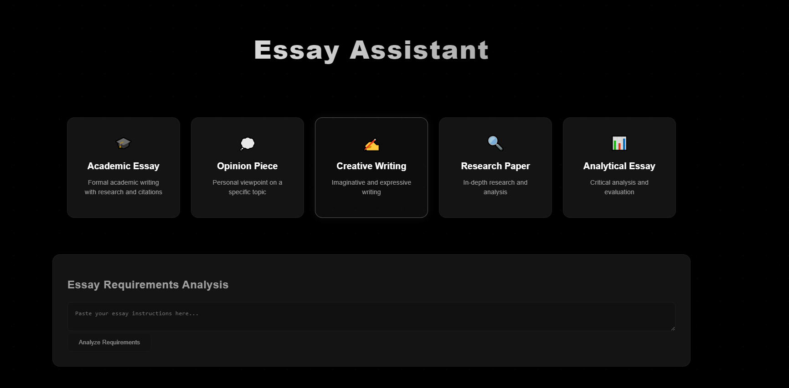

# Essay Assistant (WORK IN PROGRESS) 🚧

An AI-powered tool to help with academic essay planning, analysis, and improvement.



## Features

- Multiple essay type support (Academic, Opinion, Creative, Research, Analytical)
- Automatic requirements analysis
- Detailed essay structure planning
- Real-time essay analysis and feedback
- Academic writing style suggestions

## Tech Stack

- React + TypeScript
- Vite
- Groq AI API
- Tailwind CSS

## Setup

1. Clone the repository
```bash
git clone [your-repo-url]
cd essay-assistant
```

2. Install dependencies
```bash
npm install
```

3. Set up environment variables
   - Create a `.env` file in the root directory
   - Get your API key from [Groq Console](https://console.groq.com/docs/overview)
   - Add your API key to the `.env` file:
```bash
VITE_GROQ_API_KEY=your_api_key_here
```

4. Start the development server
```bash
npm run dev
```

## Usage

1. Select your essay type from the available options
2. Enter your essay prompt or requirements
3. Get an automated analysis of the requirements
4. Receive a detailed essay structure plan
5. Write or paste your essay
6. Get instant feedback and suggestions for improvement

## Project Structure

```
essay-assistant/
├── src/
│   ├── components/         # React components
│   ├── services/          # API and utility services
│   ├── types/            # TypeScript type definitions
│   └── assets/           # Static assets
├── public/               # Public assets
└── ...config files
```

## Contributing

This project is currently under development. Contributions, issues, and feature requests are welcome!

## Environment Variables

Required environment variables:
- `VITE_GROQ_API_KEY`: Your Groq API key (Get it from [Groq Console](https://console.groq.com/docs/overview))

## License

MIT License

Copyright (c) 2024 RampeK

Permission is hereby granted, free of charge, to any person obtaining a copy
of this software and associated documentation files (the "Software"), to deal
in the Software without restriction, including without limitation the rights
to use, copy, modify, merge, publish, distribute, sublicense, and/or sell
copies of the Software, and to permit persons to whom the Software is
furnished to do so, subject to the following conditions:

The above copyright notice and this permission notice shall be included in all
copies or substantial portions of the Software.

THE SOFTWARE IS PROVIDED "AS IS", WITHOUT WARRANTY OF ANY KIND, EXPRESS OR
IMPLIED, INCLUDING BUT NOT LIMITED TO THE WARRANTIES OF MERCHANTABILITY,
FITNESS FOR A PARTICULAR PURPOSE AND NONINFRINGEMENT. IN NO EVENT SHALL THE
AUTHORS OR COPYRIGHT HOLDERS BE LIABLE FOR ANY CLAIM, DAMAGES OR OTHER
LIABILITY, WHETHER IN AN ACTION OF CONTRACT, TORT OR OTHERWISE, ARISING FROM,
OUT OF OR IN CONNECTION WITH THE SOFTWARE OR THE USE OR OTHER DEALINGS IN THE
SOFTWARE.

## Acknowledgments

- Powered by [Groq AI](https://console.groq.com/)
- Built with [React](https://reactjs.org/) and [Vite](https://vitejs.dev/)